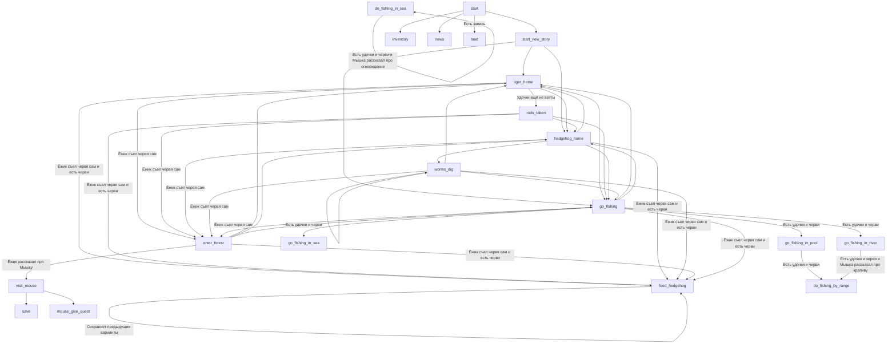

```mermaid
graph TD
    
    start --> start_new_story
    start --> inventory
    start --> news
    start --> |Есть запись| load

    start_new_story --> tiger_home
    start_new_story --> hedgehog_home
    start_new_story --> go_fishing

    tiger_home --> hedgehog_home
    tiger_home --> go_fishing
    tiger_home --> |Удочки ещё не взяты| rods_taken
    tiger_home --> |Ёжик съел червя сам и есть черви| feed_hedgehog
    tiger_home --> |Ёжик съел червя сам| enter_forest

    rods_taken --> hedgehog_home
    rods_taken --> go_fishing
    rods_taken --> |Ёжик съел червя сам и есть черви| feed_hedgehog
    rods_taken --> |Ёжик съел червя сам| enter_forest

    hedgehog_home --> tiger_home
    hedgehog_home --> worms_dig
    hedgehog_home --> go_fishing
    hedgehog_home --> |Ёжик съел червя сам и есть черви| feed_hedgehog
    hedgehog_home --> |Ёжик съел червя сам| enter_forest

    worms_dig --> tiger_home
    worms_dig --> worms_dig
    worms_dig --> go_fishing
    worms_dig --> |Ёжик съел червя сам и есть черви| feed_hedgehog
    worms_dig --> |Ёжик съел червя сам| enter_forest

    enter_forest --> tiger_home
    enter_forest --> hedgehog_home
    enter_forest --> go_fishing
    enter_forest --> |Ёжик съел червя сам и есть черви| feed_hedgehog
    enter_forest --> |Ёжик рассказал про Мышку| visit_mouse

    go_fishing --> tiger_home
    go_fishing --> hedgehog_home
    go_fishing --> |Есть удочки и черви| go_fishing_in_pool
    go_fishing --> |Есть удочки и черви| go_fishing_in_river
    go_fishing --> |Есть удочки и черви| go_fishing_in_sea
    go_fishing --> |Ёжик съел червя сам и есть черви| feed_hedgehog
    go_fishing --> |Ёжик съел червя сам| enter_forest

    feed_hedgehog --Сохраняет предыдущие варианты--> feed_hedgehog

    go_fishing_in_pool --> |Есть удочки и черви| do_fishing_by_range

    go_fishing_in_river --> |Есть удочки и черви и Мышка рассказал про крапиву| do_fishing_by_range

    do_fishing_in_sea --> |Есть удочки и черви и Мышка рассказал про огнеождение| do_fishing_in_sea

    visit_mouse --> save
    visit_mouse --> mouse_give_quest

```